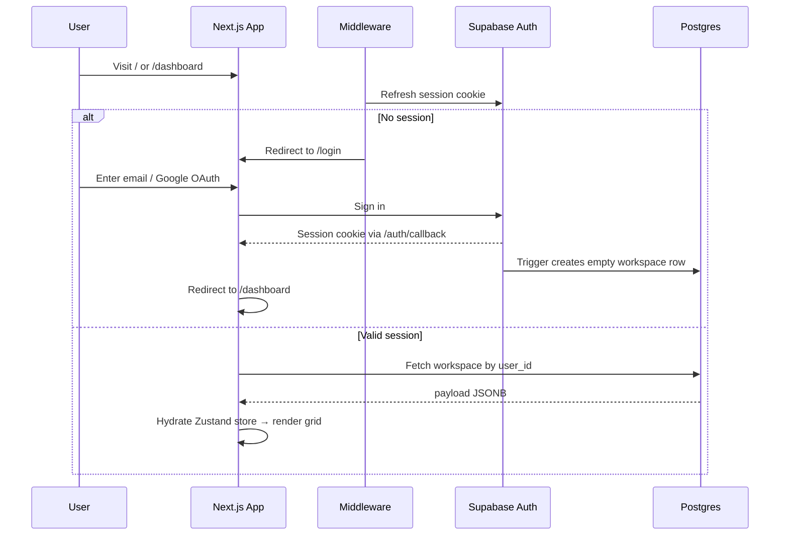
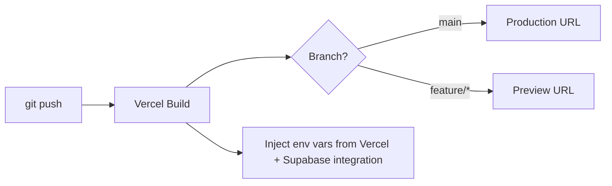
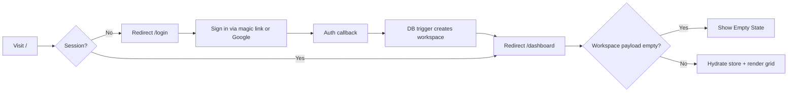
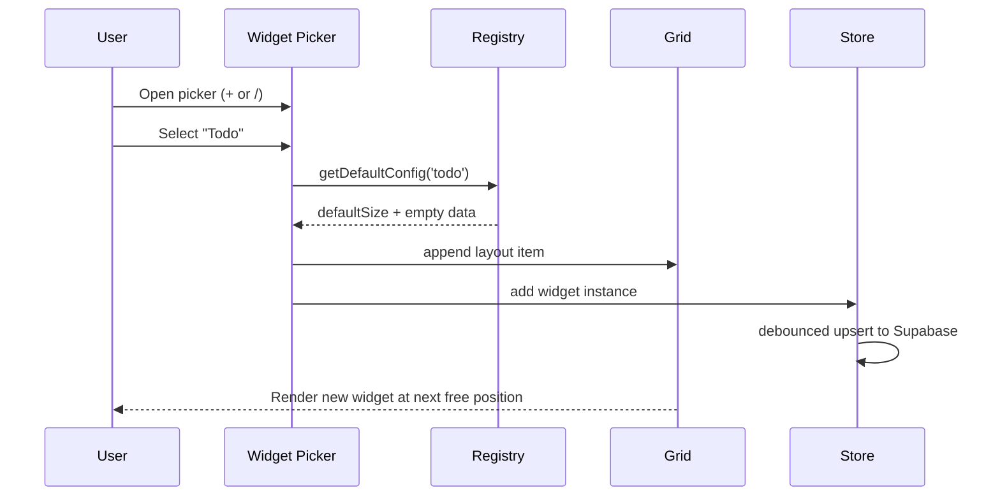
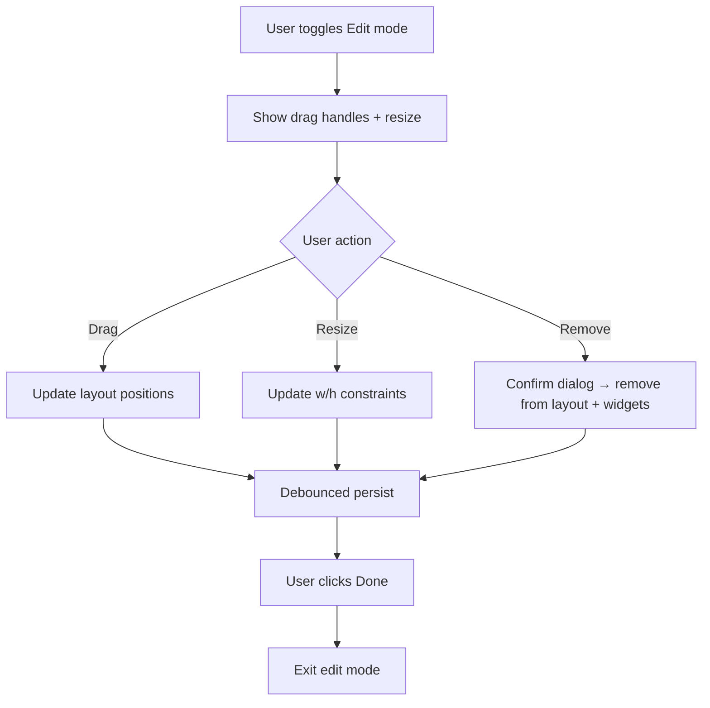
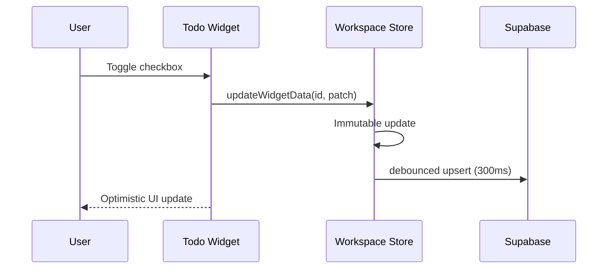

# Pane — Design & Implementation Plan

> **Status:** Ready for review — core decisions locked (Vercel, Supabase, auth-required)  
> **Product name:** **Pane** — tagline: *Your personal workspace*  
> **Date:** 2026-06-23  
> **Scope:** Build-your-own workspace dashboard with add/remove widgets (Todo, Timer, Notes, Habit Grid), Notion-inspired minimal UX  
> **Deployment:** Vercel (hosting) + Supabase (auth & Postgres — **required from day one**)

---

## Table of Contents

1. [Vision & Goals](#1-vision--goals)
2. [Branding](#2-branding)
3. [Design References](#3-design-references)
4. [Approach Options](#4-approach-options)
5. [Recommended Architecture](#5-recommended-architecture)
6. [Infrastructure & Deployment (Vercel + Supabase)](#6-infrastructure--deployment-vercel--supabase)
7. [Tech Stack](#7-tech-stack)
8. [Design System](#8-design-system)
9. [Information Architecture & Layout](#9-information-architecture--layout)
10. [Widget Specifications](#10-widget-specifications)
11. [Data Model & Persistence](#11-data-model--persistence)
12. [System Flows](#12-system-flows)
13. [Responsive Behavior](#13-responsive-behavior)
14. [Accessibility & UX Quality](#14-accessibility--ux-quality)
15. [Error Handling & Edge Cases](#15-error-handling--edge-cases)
16. [Testing Strategy](#16-testing-strategy)
17. [Implementation Phases](#17-implementation-phases)
18. [Future Extensions (Out of Scope v1)](#18-future-extensions-out-of-scope-v1)
19. [Open Decisions](#19-open-decisions)

---

## 1. Vision & Goals

### Problem

Productivity tools are fragmented — todos live in one app, timers in another, notes elsewhere, and habit trackers in yet another. Users want a **single calm workspace** they can shape to their workflow.

### Solution

A **minimal, responsive, customizable workspace** — **Pane** — where users:

- Add, remove, resize, and rearrange widgets on a grid
- **Require sign-in** — users authenticate via Supabase before accessing the dashboard
- Persist all workspace data to **Supabase Postgres** (per-user, RLS-protected)
- Deploy on **Vercel** with preview URLs for every branch
- Work in a Notion-like aesthetic: clean typography, generous whitespace, subtle borders, no visual noise

### Success Criteria

| Criteria | Target |
|----------|--------|
| Time to first widget | < 60 seconds from sign-in (including onboarding) |
| Layout persistence | Survives refresh; syncs across devices via Supabase |
| Responsive | Usable on 375px phone through 1440px desktop |
| Performance | Widget drag feels < 100ms input latency; no layout jank |
| Accessibility | WCAG 2.1 AA for core flows (keyboard, contrast, focus) |
| Customization | User can rename dashboard, toggle light/dark, pick accent color |

### Non-Goals (v1)

- Multi-user collaboration / real-time sync
- Mobile native apps
- Third-party widget marketplace
- AI-generated layouts

---

## 2. Branding

| Element | Value | Usage |
|---------|-------|-------|
| **Product name** | **Pane** | Login page, browser tab, README, marketing |
| **Tagline** | *Your personal workspace* | Login subtitle, meta description |
| **Default workspace title** | My Workspace | Editable per user in dashboard top bar (not the product name) |
| **npm package name** | `pane` | `package.json` when scaffolded |
| **Browser title** | `Pane` | `app/layout.tsx` metadata |

**Voice:** Calm, minimal, confident — avoid "dashboard builder" in user-facing copy; prefer *workspace*, *widgets*, *layout*.

---

## 3. Design References

Minimal, widget-based dashboards to borrow patterns from (not copy):

| Reference | What to borrow | What to avoid |
|-----------|----------------|---------------|
| [Notion](https://notion.so) | Block-like cards, slash-command mental model, calm neutrals, inline editing | Full block editor complexity, database views |
| [Dashly](https://dashly.live/) | Widget catalog, auto-save notes, drag reorder within widgets | Heavy marketing chrome, too many widget types at launch |
| [mykk.us dashboard](https://github.com/MichalAFerber/mykk.us-dashboard) | 12-column grid, per-widget sizing, responsive collapse | Single-file architecture (too limiting for maintainability) |
| [Dashy (Nextcloud)](https://github.com/SchBenedikt/dashy) | Per-user persistence, widget settings panel, vue-grid-layout patterns | Nextcloud coupling |

**Design direction:** Notion's calm neutrals + Dashly's widget picker simplicity + react-grid-layout's drag/resize ergonomics.

---

## 4. Approach Options

### Option A — Local-First SPA

**Stack:** Next.js (App Router) + react-grid-layout + localStorage (+ IndexedDB for larger payloads)

| Pros | Cons |
|------|------|
| Fastest path to MVP; no backend required | No cross-device sync in v1 |
| Works offline immediately | Data tied to browser |
| Simple deploy (Vercel static/edge) | Must migrate carefully when adding auth |

**Best for:** Personal dashboard, hackathon/MVP, iCARE AI Launch demo.

---

### Option B — Full-Stack with Auth & DB

**Stack:** Next.js + Supabase/Neon (Postgres) + auth (Clerk or Supabase Auth)

| Pros | Cons |
|------|------|
| Cross-device sync from day one | Slower MVP; auth/onboarding overhead |
| User accounts, backup, export | Hosting + DB costs |
| Foundation for teams later | More infra to maintain |

**Best for:** SaaS product intent from the start.

---

### Option C — Embedded / Browser Start Page

**Stack:** Vite + React SPA, optional browser extension new-tab override

| Pros | Cons |
|------|------|
| Always-visible on new tab | Extension review process |
| Zero server | Limited Next.js ecosystem benefits |
| Ultra-light | Harder to add server features later |

**Best for:** Personal new-tab replacement only.

---

### Recommendation ✅ (Final)

**Option B — Full-Stack: Vercel + Supabase with auth-required access.**

| Requirement | Implementation |
|-------------|----------------|
| **Auth** | Required — no dashboard without valid Supabase session |
| **Persistence** | Supabase Postgres only (`workspaces.payload` JSONB) |
| **Route protection** | Next.js middleware redirects unauthenticated users to `/login` |
| **First login** | Auto-create empty workspace row for new users |

```
StorageAdapter (single backend — no guest path)
└── SupabaseStorageAdapter   → all reads/writes via Postgres + RLS
```

**Why auth-required fits this product:**

- Every user's data is private from the start (RLS enforced)
- Cross-device sync works immediately — no migration from localStorage
- Simpler mental model: one source of truth, no guest/cloud conflict dialogs
- Aligns with Vercel + Supabase as a cohesive SaaS stack

---

## 5. Recommended Architecture

### High-Level Diagram

```mermaid
flowchart TB
    subgraph Vercel["Vercel"]
        Next[Next.js App Router]
        Edge[Edge Middleware — auth session refresh]
        Preview[Preview Deployments per branch]
    end

    subgraph Client["Browser (authenticated)"]
        UI[Dashboard Shell]
        GP[Widget Picker]
        GL[Grid Layout Engine]
        WR[Widget Registry]
        WS[Workspace Store]
        SA[Supabase Storage Adapter]
    end

    subgraph Supabase["Supabase"]
        Auth[Supabase Auth]
        PG[(Postgres — workspaces table)]
        RLS[Row Level Security]
    end

    Next --> Client
    Edge --> Auth
    Edge -->|no session| Login[/login]
    Edge -->|valid session| UI
    UI --> GL
    UI --> GP
    GP --> WR
    GL --> WR
    GL --> WS
    WS --> SA
    SA --> PG
    Auth --> PG
    PG --> RLS
```

### Layer Responsibilities

| Layer | Responsibility |
|-------|----------------|
| **Dashboard Shell** | Top bar, theme, edit mode toggle, empty state |
| **Grid Layout Engine** | 12-col responsive grid, drag, drop, resize, serialize layout |
| **Widget Registry** | Maps widget type → React component + default config + metadata |
| **Widget Store** | Per-widget data (todos, notes text, habit completions) |
| **Workspace Store** | Layout, active widgets, global settings (theme, accent) |
| **Storage Adapter** | Load/save workspace JSON to Supabase; debounced upserts |
| **Auth Gate** | Middleware + server checks; `/dashboard` is protected |

### Folder Structure (planned)

```
pane/
├── app/
│   ├── layout.tsx              # fonts, theme provider
│   ├── page.tsx                # redirect → /dashboard or /login
│   ├── login/
│   │   └── page.tsx            # sign-in / sign-up (public)
│   ├── auth/
│   │   └── callback/
│   │       └── route.ts        # Supabase OAuth/magic-link callback
│   ├── dashboard/
│   │   └── page.tsx            # protected — main workspace
│   └── globals.css
├── components/
│   ├── auth/
│   │   ├── LoginForm.tsx
│   │   └── AuthProvider.tsx
│   ├── dashboard/
│   │   ├── DashboardShell.tsx
│   │   ├── GridCanvas.tsx
│   │   ├── WidgetPicker.tsx
│   │   ├── EditModeToolbar.tsx
│   │   └── EmptyState.tsx
│   ├── widgets/
│   │   ├── WidgetChrome.tsx
│   │   ├── todo/
│   │   ├── timer/
│   │   ├── notes/
│   │   └── habit-grid/
│   └── ui/
├── lib/
│   ├── supabase/
│   │   ├── client.ts
│   │   ├── server.ts
│   │   └── middleware.ts
│   ├── storage/
│   │   ├── adapter.ts
│   │   └── supabase-storage.ts
│   ├── stores/
│   │   └── workspace-store.ts
│   ├── widgets/
│   │   └── registry.ts
│   └── types/
│       └── workspace.ts
├── supabase/
│   └── migrations/
│       └── 001_workspaces.sql
├── middleware.ts               # protect /dashboard; refresh session
├── docs/
└── package.json
```

### Key Patterns

1. **Widget Registry** — each widget exports `{ type, label, icon, defaultSize, defaultConfig, component }`
2. **Widget Chrome** — shared wrapper: title, overflow menu (duplicate, remove, settings), drag handle in edit mode
3. **Optimistic UI** — all edits apply immediately; storage writes debounced (300ms)
4. **Edit vs View mode** — drag/resize only in edit mode; prevents accidental moves during daily use
5. **Auto-provision workspace** — on first authenticated visit, insert default empty workspace row if none exists

### Route Map

| Route | Access | Purpose |
|-------|--------|---------|
| `/` | Public | Redirect to `/dashboard` or `/login` |
| `/login` | Public | Email magic link + optional Google OAuth |
| `/auth/callback` | Public | Supabase auth callback handler |
| `/dashboard` | **Protected** | Main widget grid (requires session) |

---

## 6. Infrastructure & Deployment (Vercel + Supabase)

### Platform Roles

| Service | Role | Why |
|---------|------|-----|
| **Vercel** | Host Next.js, CI/CD, preview URLs, env vars | First-class Next.js support; deploy on every push |
| **Supabase** | Postgres database + Auth | JSONB workspace storage, RLS, email/OAuth login via Marketplace |

### Vercel Setup

| Item | Detail |
|------|--------|
| Framework preset | Next.js (auto-detected) |
| Build command | `next build` |
| Output | Serverless Functions + static assets |
| Node version | 20.x |
| Preview deploys | Every PR gets a unique URL |
| Production | `main` branch → production domain |

**Recommended Vercel project settings:**

- Enable **Vercel Analytics** (optional, lightweight)
- Link Git repo for automatic deploys
- Pull env vars locally: `vercel env pull .env.local`

### Supabase Setup (via Vercel Marketplace)

1. In Vercel dashboard → **Integrations** → install **Supabase**
2. Link Supabase project to Vercel project (auto-provisions env vars)
3. Run SQL migration for `workspaces` table (see Section 11)
4. Enable Auth providers: **Email (magic link)** + **Google** (optional)

### Environment Variables

| Variable | Where | Purpose |
|----------|-------|---------|
| `NEXT_PUBLIC_SUPABASE_URL` | Client + Server | Supabase project URL |
| `NEXT_PUBLIC_SUPABASE_ANON_KEY` | Client + Server | Public anon key (RLS protects data) |
| `SUPABASE_SERVICE_ROLE_KEY` | Server only | Admin ops — never expose to client |

> Supabase env vars are **required from Phase 0**. The app will not function without auth + database configured.

### Supabase Database Schema

```sql
-- supabase/migrations/001_workspaces.sql

create table public.workspaces (
  id          uuid primary key default gen_random_uuid(),
  user_id     uuid not null references auth.users(id) on delete cascade,
  name        text not null default 'My Workspace',
  payload     jsonb not null default '{}',  -- full Workspace JSON (layout + widgets + settings)
  updated_at  timestamptz not null default now(),
  unique (user_id)  -- one workspace per user in v1
);

alter table public.workspaces enable row level security;

create policy "Users can read own workspace"
  on public.workspaces for select
  using (auth.uid() = user_id);

create policy "Users can insert own workspace"
  on public.workspaces for insert
  with check (auth.uid() = user_id);

create policy "Users can update own workspace"
  on public.workspaces for update
  using (auth.uid() = user_id);

create index workspaces_user_id_idx on public.workspaces (user_id);

-- Auto-create workspace on new user sign-up
create or replace function public.handle_new_user()
returns trigger as $$
begin
  insert into public.workspaces (user_id, payload)
  values (new.id, '{}');
  return new;
end;
$$ language plpgsql security definer;

create trigger on_auth_user_created
  after insert on auth.users
  for each row execute function public.handle_new_user();
```

**Why JSONB for `payload`:** Widget types evolve quickly; storing the full workspace document avoids premature relational normalization. Index on `user_id` only — sufficient for v1 (one row per user).

### Auth Flow (Required)



**Middleware rules:**

- `/dashboard` → redirect to `/login` if no session
- `/login` → redirect to `/dashboard` if already signed in
- `/` → redirect based on session state

### Deployment Pipeline



### Cost Estimate (Personal / Demo Scale)

| Service | Free tier | Notes |
|---------|-----------|-------|
| Vercel Hobby | Free | Sufficient for demo; 100GB bandwidth |
| Supabase Free | Free | 500MB DB, 50K MAU auth | 
| Total MVP | **$0** | Upgrade when traffic grows |

---

## 7. Tech Stack

### Core

| Category | Choice | Rationale |
|----------|--------|-----------|
| Framework | **Next.js 15** (App Router) | SSR for shell, easy Vercel deploy, React 19 |
| Language | **TypeScript** | Type-safe widget configs & layout schema |
| Styling | **Tailwind CSS v4** | Token-driven theming, responsive utilities |
| Components | **shadcn/ui** | Accessible primitives (Dialog, Dropdown, Button) |
| Icons | **Lucide React** | Consistent SVG icons (no emoji icons) |
| Grid | **react-grid-layout** | Industry standard drag/resize; breakpoint layouts |
| State | **Zustand** + persist | Client store; syncs to adapter on change |
| Auth & DB | **Supabase** (`@supabase/supabase-js`, `@supabase/ssr`) | Auth + Postgres; Vercel Marketplace integration |
| Fonts | **Inter** (body) + **JetBrains Mono** (timer) | Notion-adjacent; readable at all sizes |

### Supporting Libraries

| Need | Library |
|------|---------|
| Date handling (habit grid) | `date-fns` |
| ID generation | `nanoid` |
| Class merging | `clsx` + `tailwind-merge` |
| Form validation (widget settings) | `zod` |
| Supabase client | `@supabase/supabase-js`, `@supabase/ssr` |
| Unit tests | Vitest + Testing Library |
| E2E | Playwright (post-deploy smoke tests) |

### Deployment & Ops

| Category | Choice |
|----------|--------|
| Hosting | **Vercel** (production + preview) |
| Database | **Supabase Postgres** (required) |
| Auth | **Supabase Auth** — required before dashboard access |
| Env management | Vercel dashboard + `vercel env pull` |
| CI | Vercel Git integration (build on push) |
| Analytics (optional) | Vercel Analytics |
| Local dev | `next dev` + Supabase local (optional) or cloud project |

### Why Not X

| Alternative | Reason to defer |
|-------------|-----------------|
| Redux | Overkill for widget-local state |
| gridstack.js | Less React-native than RGL |
| Clerk / Auth0 | Supabase bundles auth + DB; fewer vendors |
| Neon direct | Supabase adds Auth + RLS + dashboard; installable via Vercel Marketplace |
| Vercel Postgres | Supabase chosen for integrated auth; either works on Vercel |
| React Native | Responsive web workspace only |

---

## 8. Design System

Generated via **UI/UX Pro Max** (`productivity dashboard workspace customizable widgets minimal`) and adapted for a **Notion-like light-first** aesthetic.

### Design Principles

1. **Content over chrome** — widgets are the UI; shell stays invisible
2. **Whitespace is structure** — 8px spacing rhythm, generous card padding
3. **One primary action per surface** — e.g. "Add widget" OR "Start timer", not both competing
4. **Motion with meaning** — 150–200ms transitions; respect `prefers-reduced-motion`
5. **Token-driven theming** — no raw hex in components

### Color Palette

#### Light Mode (Default — Notion-inspired)

| Token | Hex | Usage |
|-------|-----|-------|
| `--color-background` | `#FBFBFA` | Page background (warm off-white) |
| `--color-surface` | `#FFFFFF` | Widget cards |
| `--color-foreground` | `#37352F` | Primary text |
| `--color-muted-foreground` | `#787774` | Secondary text, placeholders |
| `--color-border` | `#E9E9E7` | Card borders, dividers |
| `--color-muted` | `#F1F1EF` | Hover rows, subtle fills |
| `--color-primary` | `#2383E2` | Links, active nav, focus ring |
| `--color-on-primary` | `#FFFFFF` | Text on primary buttons |
| `--color-accent` | `#0D9488` | Success, habit completion, positive states |
| `--color-accent-muted` | `#CCFBF1` | Habit cell completed background |
| `--color-destructive` | `#EB5757` | Delete, overdue, timer alert |
| `--color-warning` | `#D9730D` | Due soon, break reminder |
| `--color-ring` | `#2383E2` | Focus outline |

#### Dark Mode

| Token | Hex | Usage |
|-------|-----|-------|
| `--color-background` | `#191919` | Page background |
| `--color-surface` | `#252525` | Widget cards |
| `--color-foreground` | `#E8E8E6` | Primary text |
| `--color-muted-foreground` | `#9B9A97` | Secondary text |
| `--color-border` | `#373737` | Borders |
| `--color-muted` | `#2F2F2F` | Hover fills |
| `--color-primary` | `#529CCA` | Primary actions |
| `--color-accent` | `#2DD4BF` | Success / habits |
| `--color-destructive` | `#FF7369` | Destructive actions |

#### User Customization (v1)

- **Accent color picker:** 6 presets (Blue, Teal, Purple, Orange, Rose, Gray) overriding `--color-primary`
- **Theme:** Light / Dark / System

### Typography

| Role | Font | Size | Weight | Line-height |
|------|------|------|--------|-------------|
| Display | Inter | 32px | 600 | 1.2 |
| H1 (dashboard title) | Inter | 24px | 600 | 1.3 |
| H2 (widget title) | Inter | 14px | 600 | 1.4 |
| Body | Inter | 16px | 400 | 1.5 |
| Small / meta | Inter | 12px | 400 | 1.4 |
| Mono (timer) | `"JetBrains Mono", monospace` | 28px | 500 | 1 |

```css
@import url('https://fonts.googleapis.com/css2?family=Inter:wght@400;500;600;700&family=JetBrains+Mono:wght@500&display=swap');
```

### Spacing & Layout Tokens

| Token | Value |
|-------|-------|
| `--space-1` | 4px |
| `--space-2` | 8px |
| `--space-3` | 12px |
| `--space-4` | 16px |
| `--space-6` | 24px |
| `--space-8` | 32px |
| `--radius-sm` | 6px |
| `--radius-md` | 8px |
| `--radius-lg` | 12px |
| `--shadow-sm` | `0 1px 2px rgba(0,0,0,0.04)` |
| `--shadow-md` | `0 4px 12px rgba(0,0,0,0.08)` |

### Z-Index Scale

| Layer | z-index |
|-------|---------|
| Base content | 0 |
| Widget being dragged | 10 |
| Sticky header | 20 |
| Widget picker / modal | 40 |
| Toast notifications | 50 |

### Component Style Notes

- **Widget cards:** white surface, 1px border, `--radius-lg`, no heavy shadow (Notion-like flat)
- **Edit mode:** dashed border on grid, visible drag handles, subtle "Editing layout" banner
- **Buttons:** primary = filled; secondary = ghost with border; destructive = red text/button separated from primary row
- **Empty state:** centered illustration (SVG), one sentence, single CTA "Add your first widget"

---

## 9. Information Architecture & Layout

### Login Page (Public — `/login`)

Minimal, centered card — no dashboard chrome visible.

```
┌─────────────────────────────────────────┐
│                                         │
│         Pane                            │
│         Your personal workspace         │
│                                         │
│   ┌───────────────────────────────┐     │
│   │  Email                        │     │
│   │  [________________________]   │     │
│   │                               │     │
│   │  [ Continue with email ]      │     │
│   │                               │     │
│   │  ─────── or ───────           │     │
│   │                               │     │
│   │  [ Continue with Google ]     │     │
│   └───────────────────────────────┘     │
│                                         │
└─────────────────────────────────────────┘
```

- Single primary CTA per method (email magic link sent on submit)
- Success state: "Check your email for a sign-in link"
- No sign-up vs sign-in split — Supabase handles both via magic link

### App Shell (Protected — `/dashboard`)

```
┌─────────────────────────────────────────────────────────────┐
│  [Logo]  My Workspace    [Edit] [Theme] [+ Widget] [Sign out]│  ← Top bar
├─────────────────────────────────────────────────────────────┤
│                                                             │
│   ┌──────────────┐  ┌──────────────┐  ┌──────────────┐     │
│   │ Todo         │  │ Timer        │  │ Notes        │     │
│   │              │  │              │  │              │     │
│   └──────────────┘  └──────────────┘  └──────────────┘     │
│   ┌────────────────────────────┐                           │
│   │ Habit Grid                 │                           │
│   └────────────────────────────┘                           │
│                                                             │
└─────────────────────────────────────────────────────────────┘
```

### Widget Picker (Modal / Command Palette)

Triggered by **+ Widget** button or **`/`** keyboard shortcut (when not typing in an input).

```
┌─ Add Widget ────────────────────────────────┐
│  🔍 Search widgets...                        │
├──────────────────────────────────────────────┤
│  ☐ Todo          Checklists with due dates   │
│  ⏱ Timer         Pomodoro & stopwatch        │
│  📝 Notes        Auto-saving text area         │
│  ▦ Habit Grid    Monthly completion grid      │
└──────────────────────────────────────────────┘
```

*(Use Lucide icons in implementation — not emoji.)*

### Edit Mode

- Toggle via **Edit layout** button or `E` shortcut
- Enables: drag handles, resize corners, remove widget, add widget
- Disables: accidental text selection during drag
- **Done** button exits edit mode and saves layout

---

## 10. Widget Specifications

### Shared Widget Chrome

Every widget includes:

| Element | Behavior |
|---------|----------|
| Title | Editable inline (double-click or pencil icon) |
| Menu (⋯) | Duplicate, Remove, Widget settings |
| Drag handle | Visible only in edit mode (top-left grip icon) |
| Min size | Enforced per widget type |

---

### 8.1 Todo Widget

**Purpose:** Simple checklist with optional due dates and completion tracking.

**Default size:** 4 cols × 5 rows

**Features (v1):**

- Add task via input + Enter
- Checkbox toggle complete
- Optional due date (date picker)
- Delete task (swipe or menu on row)
- Clear completed
- Drag reorder tasks within widget
- Task count in widget subtitle

**Data shape:**

```typescript
interface TodoItem {
  id: string;
  text: string;
  completed: boolean;
  dueDate?: string; // ISO date
  order: number;
  createdAt: string;
}

interface TodoWidgetData {
  items: TodoItem[];
  showCompleted: boolean;
}
```

**Empty state:** "No tasks yet — add one above"

---

### 8.2 Timer Widget

**Purpose:** Focus timer (Pomodoro) and simple stopwatch.

**Default size:** 3 cols × 4 rows

**Modes:**

1. **Pomodoro** — work (25m) / short break (5m) / long break (15m) — configurable
2. **Stopwatch** — count up

**Features (v1):**

- Start / Pause / Reset
- Mode switch (tabs)
- Audio chime on complete (toggle in settings, off by default)
- Persist elapsed state across refresh (timestamp-based)
- Display mono font countdown

**Data shape:**

```typescript
interface TimerWidgetData {
  mode: 'pomodoro' | 'stopwatch';
  pomodoro: {
    workMinutes: number;
    shortBreakMinutes: number;
    longBreakMinutes: number;
    phase: 'work' | 'shortBreak' | 'longBreak';
  };
  stopwatch: {
    elapsedMs: number;
    running: boolean;
    startedAt?: string;
  };
  soundEnabled: boolean;
}
```

**Edge case:** Use `startedAt` + `Date.now()` diff when restoring running timer after refresh.

---

### 8.3 Notes Widget

**Purpose:** Auto-saving freeform text area (Notion-lite).

**Default size:** 4 cols × 6 rows

**Features (v1):**

- Multi-line textarea filling widget body
- Auto-save on debounce (500ms)
- Optional markdown preview toggle (v1.1 — plain text v1)
- Character count in footer (subtle)

**Data shape:**

```typescript
interface NotesWidgetData {
  content: string;
  lastEditedAt: string;
}
```

---

### 8.4 Habit Grid Widget

**Purpose:** GitHub-contribution-style monthly grid for daily habit tracking.

**Default size:** 6 cols × 5 rows

**Features (v1):**

- One habit name (editable)
- Current month grid (cells = days)
- Tap cell to toggle complete
- Color intensity: empty → accent-muted → accent
- Navigate prev/next month
- Streak count display (current streak, best streak)

**Data shape:**

```typescript
interface HabitGridWidgetData {
  habitName: string;
  completions: Record<string, boolean>; // key: "YYYY-MM-DD"
}
```

**Accessibility:** Each cell has `aria-label` e.g. "June 15, completed" / "June 16, not completed"

---

## 11. Data Model & Persistence

### Workspace Schema

```typescript
interface Workspace {
  version: 1;
  id: string;
  name: string;
  settings: {
    theme: 'light' | 'dark' | 'system';
    accent: 'blue' | 'teal' | 'purple' | 'orange' | 'rose' | 'gray';
    editMode: boolean;
  };
  layout: LayoutItem[];
  widgets: Record<string, WidgetInstance>;
}

interface LayoutItem {
  i: string;       // widget instance id
  x: number;
  y: number;
  w: number;
  h: number;
  minW?: number;
  minH?: number;
}

interface WidgetInstance {
  id: string;
  type: 'todo' | 'timer' | 'notes' | 'habit-grid';
  title: string;
  data: TodoWidgetData | TimerWidgetData | NotesWidgetData | HabitGridWidgetData;
}
```

### Storage Strategy

| Layer | Role |
|-------|------|
| **Zustand (client)** | In-memory workspace state during session; optimistic updates |
| **Supabase Postgres** | Source of truth — `workspaces.payload` JSONB per user |
| **Debounced upsert** | 300ms after last edit → `UPDATE workspaces SET payload = ...` |

No localStorage for workspace data. Client store is hydrated from Supabase on mount and cleared on sign-out.

### Migration Strategy

- `version` field in schema
- On load: if version mismatch, run migration function chain
- Export/import JSON via Settings (backup)

### Sync Flow

```mermaid
sequenceDiagram
    participant U as User
    participant App as Dashboard App
    participant Store as Zustand Store
    participant SB as Supabase Client
    participant DB as Postgres

    U->>App: Edit widget / layout
    App->>Store: Optimistic update
    Store->>SB: Debounced upsert (300ms)
    SB->>DB: UPDATE workspaces.payload WHERE user_id = auth.uid()
    DB-->>SB: OK
    alt Upsert fails
        SB-->>App: Error
        App->>App: Toast + retry; revert store if unrecoverable
    end
```

---

## 12. System Flows

### 11.1 First Visit



### 10.2 Add Widget



### 10.3 Edit Layout



### 10.4 Widget Data Update (e.g. Todo check)



---

## 13. Responsive Behavior

### Breakpoints (aligned with react-grid-layout)

| Breakpoint | Width | Grid cols | Behavior |
|------------|-------|-----------|----------|
| `lg` | ≥1200px | 12 | Full desktop layout |
| `md` | 996–1199px | 10 | Slightly compressed |
| `sm` | 768–995px | 6 | 2-column feel |
| `xs` | 480–767px | 4 | Stacked widgets |
| `xxs` | <480px | 2 | Single-column stack |

### Mobile-Specific UX

- Edit mode: drag handles always visible (not hover-only)
- Touch targets ≥ 44×44px on all interactive elements
- Widget picker: full-screen sheet on mobile
- Timer controls: larger tap areas
- Habit grid: horizontal scroll within widget if needed, with scroll hint

### Layout Rules

- Serialize **separate layouts per breakpoint** (RGL native feature)
- On add widget: place at bottom of stack on mobile (`y = max`)
- Reserve min heights to prevent content jump (CLS < 0.1)

---

## 14. Accessibility & UX Quality

Based on UI/UX Pro Max priority checklist:

### Must Have (v1)

- [ ] Color contrast ≥ 4.5:1 body text (both themes)
- [ ] Visible focus rings on all interactive elements
- [ ] Full keyboard navigation: Tab order, Enter/Space activation
- [ ] `aria-label` on icon-only buttons
- [ ] Habit grid: don't rely on color alone — use checkmark/icon in completed cells
- [ ] `prefers-reduced-motion`: disable drag animations / reduce transitions
- [ ] Screen reader announcements for timer completion (`aria-live="polite"`)
- [ ] Confirm before destructive actions (remove widget, clear completed todos)

### Keyboard Shortcuts

| Shortcut | Action |
|----------|--------|
| `/` | Open widget picker (when not in input) |
| `E` | Toggle edit mode |
| `Esc` | Close picker / exit edit mode |
| `?` | Show shortcuts help |

---

## 15. Error Handling & Edge Cases

| Scenario | Handling |
|----------|----------|
| Supabase upsert fails | Retry 3× with backoff; toast with retry button |
| Supabase fetch fails on load | Error screen with retry; do not render stale data |
| Auth session expired mid-edit | Redirect to `/login`; unsaved edits lost (show warning before expiry if possible) |
| Corrupt payload in DB | Reset to default empty workspace + toast |
| Invalid widget type in payload | Skip widget, log warning, show repair toast |
| Timer running during tab sleep | Recalculate from `startedAt` on visibility change |
| Duplicate widget IDs | Regenerate ID on detection |
| New user, trigger failed | Fallback: create workspace row on first dashboard load |
| Very long todo text | Truncate display with ellipsis; full text in edit |
| 50+ todos in one widget | Virtualize list (Phase 1.1 if needed) |

---

## 16. Testing Strategy

### Unit Tests (Vitest)

- Workspace store reducers (add/remove/update widget)
- Storage adapter read/write/migration
- Timer elapsed calculation after simulated time passage
- Habit streak calculation

### Component Tests (Testing Library)

- Todo: add, complete, delete
- Widget picker: search filter, select adds widget
- Edit mode: toggle shows/hides handles

### Manual QA Checklist

- [ ] Sign in via magic link → lands on `/dashboard`
- [ ] Unauthenticated visit to `/dashboard` → redirects to `/login`
- [ ] New user gets empty workspace automatically
- [ ] Add all 4 widget types; refresh → data persists in Supabase
- [ ] Sign out → cannot access dashboard without re-login
- [ ] Drag and resize on desktop
- [ ] Edit layout on mobile (375px)
- [ ] Toggle dark mode
- [ ] Keyboard-only navigation through core flows
- [ ] Reduced motion enabled

### E2E (Playwright)

- Full journey: login → empty state → add widgets → edit layout → refresh → verify Supabase persistence

---

## 17. Implementation Phases

### Phase 0 — Scaffold + Auth (Days 1–3)

- [ ] Init Next.js + TypeScript + Tailwind + shadcn/ui
- [ ] Install Supabase via Vercel Marketplace; configure env vars
- [ ] Run `001_workspaces.sql` migration (table + RLS + new-user trigger)
- [ ] Supabase SSR clients + middleware (session refresh + route protection)
- [ ] `/login` page + `/auth/callback` route
- [ ] CSS variable tokens (light/dark)
- [ ] Connect Vercel project; first preview deploy

### Phase 1 — Dashboard Shell (Days 4–6)

- [ ] Protected `/dashboard` route
- [ ] Zustand workspace store + `SupabaseStorageAdapter`
- [ ] Fetch/hydrate workspace on mount; auto-provision fallback
- [ ] DashboardShell + top bar (incl. Sign out)
- [ ] react-grid-layout integration + edit mode + empty state

### Phase 2 — Widgets + Picker (Days 7–11)

- [ ] Widget registry + WidgetChrome
- [ ] Widget picker modal
- [ ] Todo, Notes, Timer, Habit Grid widgets
- [ ] Add/remove/resize flow with debounced Supabase upserts

### Phase 3 — Polish & Production (Days 12–14)

- [ ] Theme toggle + accent presets
- [ ] Keyboard shortcuts
- [ ] Export/import workspace JSON (backup)
- [ ] Responsive breakpoint layouts
- [ ] Accessibility pass
- [ ] E2E: login → add widget → refresh → verify persistence
- [ ] **Promote to Vercel production**
- [ ] README with setup (`vercel env pull`, Supabase migration)

---

## 18. Future Extensions (Out of Scope v1)

| Feature | Notes |
|---------|-------|
| Guest / offline mode | Auth-required by design; offline read is future (PWA) |
| Multiple dashboards / pages | Notion-like sidebar |
| Widget marketplace | Registry accepts plugins |
| Calendar widget | New widget type |
| Bookmarks widget | Reference: Dashly |
| Real-time collaboration | Supabase Realtime subscriptions |
| Custom CSS injection | Power-user theming |
| PWA / offline install | Service worker + manifest |
| Browser extension new-tab | Separate distribution |

---

## 19. Open Decisions

Please confirm before implementation:

| # | Decision | Status | Value |
|---|----------|--------|-------|
| 1 | **Hosting** | ✅ Decided | **Vercel** |
| 2 | **Database & Auth** | ✅ Decided | **Supabase** (required) |
| 3 | **Require sign-in?** | ✅ Decided | **Yes (B)** — no dashboard without auth |
| 4 | **Product name** | ✅ Decided | **Pane** — tagline: *Your personal workspace* |
| 5 | **Default theme** | Open | Light (Notion-like) |
| 6 | **Auth providers** | Open | Email magic link + Google |
| 7 | **Timer default** | Open | Pomodoro 25/5/15 |
| 8 | **Markdown in notes** | Open | Plain text v1 |

---

## Appendix A — Widget Default Sizes

| Widget | w × h (grid units) | minW × minH |
|--------|-------------------|-------------|
| Todo | 4 × 5 | 3 × 3 |
| Timer | 3 × 4 | 2 × 3 |
| Notes | 4 × 6 | 3 × 4 |
| Habit Grid | 6 × 5 | 4 × 4 |

## Appendix B — Reference Links

- [react-grid-layout](https://github.com/react-grid-layout/react-grid-layout)
- [Vercel + Supabase integration](https://vercel.com/integrations/supabase)
- [Supabase Auth with Next.js App Router](https://supabase.com/docs/guides/auth/server-side/nextjs)
- [Dashly — widget UX reference](https://dashly.live/)
- [mykk.us — grid sizing reference](https://github.com/MichalAFerber/mykk.us-dashboard)

---

*End of design document. Product name: **Pane**. Implementation plan: `docs/superpowers/plans/2026-06-23-pane.md`.*
